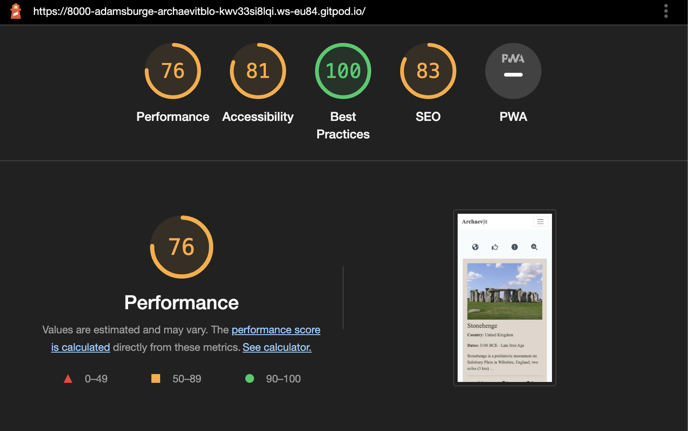

# Testing

## Responsive Testing
- Throughout the project:
    - The webapp has been manually tested for desktop on Google Chrome, Microsoft Edge, Firefox, Safari, Vivaldi and Arc. 
    - The webapp has been manually tested for mobile responsiveness on an iPhone 7, iPhone 8, and iPhone 14. The webapp has also been manually tested on an iPad 9th generation and an Onyx Boox NoteAir (1st generation). Additionally, Google devtools, [Am I Responsive?](https://ui.dev/amiresponsive) and [Screenfly](https://screenfly.org/) have been used to test the webapp on various other Apple and Android mobile phones and tablet devices from the iPhone 4 onward. 
    - The webapp looks good on all the major desktop web browsers and all the most popular tablet and mobile devices. I can confirm that the website looks good on all screensizes.

## Code Validator Testing
- HTML:
    - The HTML for the site has been checked for errors with the [W3 NU HTML Checker](https://validator.w3.org/nu/) and cleared with no errors reported.
- CSS:
    - The CSS for the site has been checked for errors with the [W3C CSS Validator](https://jigsaw.w3.org/css-validator/) and passed with no errors found.
- Javascript:
    - The Javascript for the site has been checked for errors with the [JSHint Website](https://jshint.com) and no errors were found.
- Python:
    - The Python for this site has been linted by both the built-in linter in Gitpod as well as the Code Institute Pep8 replacement linter. No significant errors were found other than indications that some lines were too long and warnings where I preferred to use tabs instead of spaces.

## Accessibility:
- I have checked the site for accessibility with Google's Lighthouse tool.
    - For Mobile: 
        
        
        
    - For Desktop:
        

## Bugs

### Solved
- Like buttons not working:
    - When I initially coded the three like buttons, only the first one was working. After reading through several forums online and the Django documentation, I realised that I was attempting to make separate views and paths out of what needed to be a single view and path which took an if statement in the single to determine on which button was clicked. To see my solution, see the PostLike class in the [views.py file](blog/views.py).
- Uploading image file on add_post and update_post views:
    - When working on the admin functionality to be able to upload an image file on the front end, I was unable to get the files to upload despite the process seeming to work. After reading more Django documentation and watching a few videos on [the Codemy.com Youtube Channel](https://www.youtube.com/playlist?list=PLCC34OHNcOtqW9BJmgQPPzUpJ8hl49AGy) by John Elder, I realised I was missing the enctype attribute in the html form.

### Unsolved
- Currently, there are no unsolved bugs that I am aware of.